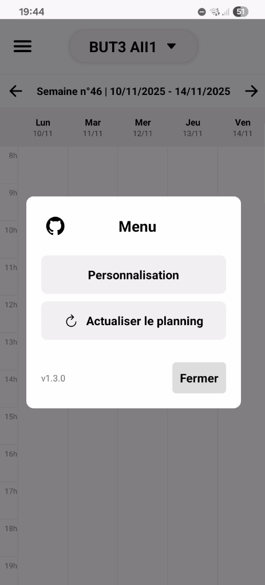

# EDT Geii Tours (Application Mobile) v1.3.0

[](https://github.com/DoodzProg/but-geii-tours-edt-mobile-app)
[](#)
[](https://expo.dev/)

Application mobile non-officielle pour la consultation des emplois du temps (EDT) des étudiants du BUT Génie Électrique et Informatique Industrielle (GEII) de l'IUT de Tours (site de Grandmont, 37).

Ce dépôt contient le code source complet de l'application.



## ✨ Fonctionnalités
* **Consultation des EDT** : Accédez à l'emploi du temps de n'importe quel groupe du BUT GEII.
* **Mise en cache intelligente** : L'emploi du temps est sauvegardé en local. Pas besoin de le regénérer à chaque ouverture.
* **Personnalisation** :
    * Thème Sombre / Clair (s'adapte au système).
    * Vue "Semaine" (5j), "Semaine & Week-end" (7j) ou "Jour".
* **Détails des cours** : Cliquez sur un cours pour voir le professeur, la salle, et les groupes concernés.
* **Sécurisé** : Utilise les API de l'université sans exposer d'identifiants dans le code (via `.env`).
* **Mode Débogage** : Accès aux logs via un "Easter Egg" (6 appuis sur le titre "Menu").
* **Actualisation forcée** : Un bouton pour forcer la regénération du calendrier en cas de bug.

---

## 🚀 Guide d'installation et d'utilisation (de A à Z)

Ce guide est destiné à toute personne souhaitant exécuter ce projet en local sur sa machine (Windows).

### Tutorial 1 : Préparer votre environnement (La base)

Avant de pouvoir lancer le projet, vous avez besoin de 3 outils essentiels sur votre PC Windows :

#### 1. Git
Git est l'outil qui vous permettra de cloner (télécharger) ce projet.
* **Téléchargement** : Allez sur [git-scm.com](https://git-scm.com/downloads) et téléchargez l'installeur pour Windows.
* **Installation** : Lancez l'installeur. **Vous pouvez laisser toutes les options par défaut** (cliquez simplement "Next" à chaque étape).

#### 2. Node.js (Version LTS)
C'est le "moteur" JavaScript qui fait tourner Expo et React Native.
* **Téléchargement** : Allez sur [nodejs.org](https://nodejs.org/) et téléchargez la version **LTS** (Long Term Support).
* **Installation** : Lancez l'installeur. Laissez toutes les options par défaut.
* **Vérification** : Après l'installation, ouvrez un nouveau terminal (PowerShell) et tapez `node -v` et `npm -v`. Si vous voyez des numéros de version, c'est bon !

#### 3. Expo Go (sur votre téléphone)
C'est l'application mobile qui va "lire" votre code en direct.
* Allez sur le **Google Play Store** sur votre téléphone Android.
* Cherchez et installez l'application **"Expo Go"**.

---

### ⚙️ Tutorial 2 : Installer et configurer le projet

Maintenant que votre PC est prêt, voici comment récupérer et configurer le projet.

#### Étape 1 : Cloner le projet
Ouvrez un terminal (PowerShell) là où vous voulez mettre votre projet (ex: `C:\Users\VotreNom\Desktop\Projets`) et tapez :
```sh
git clone https://github.com/DoodzProg/but-geii-tours-edt-mobile-app.git
````

#### Étape 2 : Entrer dans le dossier

Une fois le téléchargement fini, entrez dans le nouveau dossier :

```sh
cd but-geii-tours-edt-mobile-app
```

#### Étape 3 : Installer les dépendances

Tapez cette commande. Elle va lire le `package.json` et télécharger tous les paquets nécessaires (React, Expo, Axios, etc.) dans un dossier `node_modules`.

```sh
npm install
```

*(Cela peut prendre 1 ou 2 minutes).*

#### Étape 4 : Configuration des secrets (TRÈS IMPORTANT)

L'application a besoin d'identifiants pour se connecter à l'API de l'université. Ces identifiants sont secrets et ne sont pas sur GitHub.

1.  Dans le dossier, vous verrez un fichier nommé `.env.example`. C'est un modèle.
2.  Faites une **copie** de ce fichier et renommez la copie en **`.env`** (juste `.env`, sans rien avant).
3.  Ouvrez ce nouveau fichier `.env` avec un éditeur de texte (comme VS Code ou le Bloc-notes).
4.  Remplissez les variables avec les identifiants d'accès :

<!-- end list -->

```ini
ADE_USER= MyUserName
ADE_PASS= MyPassword
```

> **Note** : Le fichier `.gitignore` est configuré pour que votre fichier `.env` ne soit **jamais** envoyé sur GitHub. Vos secrets sont en sécurité sur votre machine.

-----

### 🏃 Tutorial 3 : Lancer l'application (Mode Développement)

Vous y êtes presque \! Votre PC et votre téléphone doivent être **sur le même réseau Wi-Fi**.

1.  Dans votre terminal (toujours dans le dossier du projet), lancez le serveur Expo :

    ```sh
    npx expo start
    ```

    *Note : Si vous avez des problèmes, relancez avec le cache vidé : `npx expo start -c`.*

2.  Un gros **QR code** va s'afficher dans votre terminal.

3.  Ouvrez l'application **Expo Go** sur votre téléphone.

4.  Depuis l'écran d'accueil d'Expo Go, scannez le QR code.

5.  L'application va se compiler ("Bundling...") et se lancer en direct sur votre téléphone \! Toutes les modifications que vous ferez dans le code (ex: `App.js`) se mettront à jour automatiquement.

-----

### 📦 Tutorial 4 : Construire l'APK (Mode Production)

Quand vous avez fini vos modifications et que vous voulez créer un fichier `.apk` final (pour l'installer directement), vous devez utiliser le service de "build" d'Expo : **EAS (Expo Application Services)**.

#### Étape 1 : Installer EAS CLI

C'est l'outil d'Expo pour gérer les builds. Tapez dans votre terminal :

```sh
npm install -g eas-cli
```

*`-g ` signifie "global", pour l'installer partout sur votre PC).*

#### Étape 2 : Se connecter à votre compte Expo

Vous avez besoin d'un compte Expo (gratuit). Si vous n'en avez pas, [créez-en un ici](https://expo.dev/signup).

```sh
eas login
```

*(Suivez les instructions pour vous connecter).*

#### Étape 3 : Configurer le projet pour EAS

EAS utilise un fichier `eas.json` pour savoir comment "builder" votre app.

1.  Lancez la commande de configuration :
    ```sh
    eas build:configure
    ```
2.  L'outil va vous poser des questions :
      * `Which platforms do you want to configure?` -\> Choisissez `Android` (avec la barre d'espace et Entrée).
      * `Generate a new Android Keystore?` -\> Dites `Yes` (c'est la "signature" de votre app).

#### Étape 4 : Lancer le build

Maintenant, dites à Expo de construire l'APK pour vous :

```sh
eas build --platform android --profile preview
```

  * `--platform android` : On veut un APK.
  * `--profile preview` : On veut un `.apk` facile à installer (parfait pour les tests).

#### Étape 5 : Télécharger l'APK

Le "build" ne se fait pas sur votre PC, mais sur les serveurs d'Expo (ça peut prendre 5-10 minutes).

Une fois terminé, EAS vous donnera un **lien de téléchargement** dans votre terminal. Vous pourrez télécharger le fichier `.apk` et l'installer sur n'importe quel téléphone Android.

## 🛠️ Stack Technique

  * **Framework** : [Expo (React Native)](https://expo.dev/)
  * **Requêtes API** : [Axios](https://axios-http.com/)
  * **Parsing Calendrier** : [ical.js](https://github.com/mozilla-comm/ical.js/)
  * **Stockage local** : [AsyncStorage](https://github.com/react-native-async-storage/async-storage)
  * **Gestion des secrets** : [react-native-dotenv](https://www.google.com/search?q=https://github.com/zetavg/react-native-dotenv)

## 📄 Licence

Ce projet est sous licence MIT.

```
```